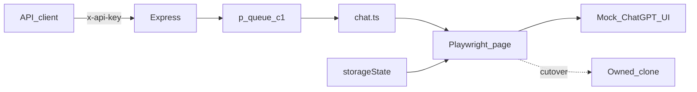
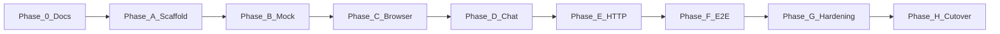

# Chatbot-to-API Bridge — Master Execution Plan

> Nawab master plan — entire project execution contract in one document.  
> **Mode:** project  
> Maintain [`PROGRESS.md`](./PROGRESS.md) during execution.

**This session / current gate:** Phase 0 documentation only. Do not write application code until the owner approves Phase A.

---

## §0 Plan metadata

| Field | Value |
|-------|-------|
| **Mode** | project (greenfield, single package) |
| **Stack** | Node 20+ / TypeScript / Express / Playwright / p-queue / zod / pino (locked; repo had no code at plan time) |
| **Base branch** | `main` |
| **Feature branch(es)** | `main` for Phase 0 docs; implementation on `feat/v1-bridge` after approval |
| **Authority docs** | `docs/PRD-chatbot-api.md` (product) · `docs/specs/01-improved-spec.md` (engineering) · `docs/specs/02-chatgpt-dom-contract.md` (DOM) · `documentation/*` (review maps) · this file (order, tests, agents) |
| **Estimated commits** | Phase 0: 1 docs commit (this). Implementation: **20** matrix rows (small greenfield / major backend — not a multi-package 30+) |
| **Lead agent** | Orchestrate, commit, integrate subagents, PR. Subagents do not commit. |

---

## §1 North star & scope boundary

### Objective

A localhost REST API that drives a ChatGPT-like chatbot UI in one persistent Playwright browser and returns the latest assistant message, built entirely against a ChatGPT-faithful mock until the owner’s URL and session file are plugged in.

### Deliverables

- Local mock chatbot implementing the ChatGPT DOM contract (sidebar, New chat **button**, contenteditable `#prompt-textarea`, send/stop, `data-message-author-role`, 3s default stream)
- Express API: `POST /chat/send`, `POST /chat/new`, `GET /health`
- Playwright lifecycle, session injection, hybrid wait, recover, artifacts
- Bounded FIFO queue (concurrency 1)
- `.env.example`, README, tests, `scripts/validate.sh`
- Cutover notes when owner URL + storageState arrive (config, not a rewrite)

### Non-goals

- Driving **chatgpt.com** or live-scraping OpenAI HTML
- Interactive login in the API process for the owned bot (owner supplies session)
- HTTP token streaming, multi-tab `sessionId`, horizontal browser pool
- Pixel-perfect OpenAI branding / trademarks on the mock
- Docker, per-user keys, stealth plugins

### Priority

| Priority | Items |
|----------|--------|
| **P0** | Mock contract UI, persistent browser, send/new/health, hybrid wait, `partial: true` on timeout, queue cap, API key, HEADLESS switch, tests vs mock |
| **P1** | Multi-tab sessions, SSE, Docker, MutationObserver wait, mock visual polish beyond landmarks |

---

## §2 Prerequisites & blockers

| Item | Status | Blocks | Resolution |
|------|--------|--------|------------|
| Product + engineering docs | **done** (Phase 0) | nothing | this plan + PRD + specs |
| ChatGPT DOM contract freeze | **done** | mock implementation | `docs/specs/02-chatgpt-dom-contract.md` |
| Owner chatbot URL | pending | **cutover only** (Phase H) | owner pastes URL when ready |
| Owner login session file | pending | **cutover only** | Playwright `storageState` JSON |
| Node 20 + Playwright browsers | pending | Phase A runtime | install at first implementation commit |
| Permission to automate chatgpt.com | N/A / refused | — | out of scope forever |

**Workaround:** all P0 implementation proceeds on the mock. Cutover is blocked on URL + session, not on code.

**Hard rule:** Phase A+ starts only after owner approval. Phase H does not start without URL + session.

---

## §3 Authority & artifact map

| Document | Path | Role |
|----------|------|------|
| Original prompt | `docs/specs/00-original-build-prompt.md` | Read-only intent archive |
| PRD | `docs/PRD-chatbot-api.md` | Product truth (what / why) |
| Engineering spec | `docs/specs/01-improved-spec.md` | How (API, wait, errors) |
| DOM contract | `docs/specs/02-chatgpt-dom-contract.md` | Mock + clone selectors/behavior |
| Assumptions | `docs/ASSUMPTIONS.md` | Risk tests |
| Shipping set | `documentation/*.md` | Reviewer maps (authz, secrets, tests) |
| IMPLEMENTATION_PLAN | `IMPLEMENTATION_PLAN.md` | This file — execution contract |
| PROGRESS | `PROGRESS.md` | Live status |
| DECISIONS | `DECISIONS.md` | ADRs |
| Spec Kit `.specify/` | — | **N/A** — nawab plan used instead of speckit |

**Read-only for subagents:** all of `docs/`, `documentation/`, this plan.  
**Writable for lead during Phase 0:** those same docs.  
**Writable after Phase A approval:** `src/`, `scripts/`, `tests/`, `package.json`, README, CI — per §9 row.

---

## §4 Architecture & system map



### Target layout (after implementation — do not create in Phase 0)

```text
src/index.ts
src/server.ts
src/automation/{browser,chat,wait-for-response,recover,queue}.ts
src/config/{env,selectors}.ts
src/lib/{errors,logger}.ts
scripts/mock-chatbot/
scripts/{discover-selectors,login,validate}.sh|.ts
tests/{api,wait-for-response,e2e-mock}.ts
data/          gitignored
artifacts/     gitignored
```

### Trust boundaries

- Client → API: shared key, localhost, prompt cap
- API → browser: one origin (`CHATBOT_URL`)
- Disk: session file + traces gitignored
- See `documentation/architecture.md`

---

## §5 Workstreams

| ID | Name | Owns paths | Depends on | Lead / subagent |
|----|------|------------|------------|-----------------|
| WS-DOC | Pre-implementation docs | `docs/`, `documentation/`, this plan | — | lead (Phase 0) |
| WS-MOCK | ChatGPT-faithful mock | `scripts/mock-chatbot/` | WS-DOC | lead |
| WS-BRIDGE | Browser + HTTP API | `src/`, `.env.example` | WS-MOCK landmarks exist | lead |
| WS-QUAL | Tests, CI, validate | `tests/`, CI, `scripts/validate.sh` | WS-BRIDGE | lead |
| WS-CUT | Owned URL cutover | env, selector verify | owner URL + session | lead + owner |

### WS-DOC — documentation

- **Objective:** PID, PRD, DOM contract, shipping artifacts, ADRs
- **Phases:** 0
- **Integration:** authority for all later streams

### WS-MOCK — replica UI

- **Objective:** local ChatGPT-like page the automation can fully exercise
- **Phases:** A–B
- **Integration:** default `CHATBOT_URL`

### WS-BRIDGE — service

- **Objective:** send / wait / scrape / queue / health
- **Phases:** C–E
- **Integration:** curl-able API

### WS-QUAL — proof

- **Objective:** tests + hardening orchestrator
- **Phases:** F–G
- **Integration:** merge gate

### WS-CUT — real UI

- **Objective:** same selectors against owned clone
- **Phases:** H
- **Integration:** env swap + smoke

---

## §6 Agent orchestration & subagent spawn map

Greenfield + one package: **lead agent implements**. Do not parallelize mock and `src/config/selectors.ts` (same contract).

| ID | Trigger | Type | readonly | Task | Sync point | Gate |
|----|---------|------|----------|------|------------|------|
| S1 | Phase 0 | — | — | **Not spawned** — empty repo, docs written by lead | — | — |
| S2 | Phase G | `security-review` | true | Branch diff: key, session file, bind address, prompt logs | Before cutover / PR | findings fixed or accepted in DECISIONS |
| S3 | Phase G | `explore` | true | Walk repo for untested paths vs `documentation/tests.md` | Hardening commits | — |
| S4 | Phase H | — | — | **Do not spawn** a scraper against chatgpt.com | — | — |

### Spawn S2 — security-review

```text
Full Repository Path: D:\Tech\Chatbot-api
Workstream: WS-QUAL
Task: Review auth, secrets on disk, localhost bind, logging of prompts, path restriction of Playwright to CHATBOT_URL
Authority: documentation/permissions.md, variables.md, automation.md, IMPLEMENTATION_PLAN §1 non-goals
Return: ranked findings with paths
Do NOT: edit files, expand to feature work, request live chatgpt.com access
```

**Parallel limit:** 2  
**File ownership:** lead owns all write paths. Subagents readonly unless a future plan revision assigns `scripts/mock-chatbot/**` only.

---

## §7 Phase map & dependencies



| Phase | Objective | Workstreams | Commits | Depends on | Exit gate |
|-------|-----------|-------------|---------|------------|-----------|
| 0 | Spec / PID / shipping docs | WS-DOC | 1 (docs) | owner answers | files listed in §3 exist |
| A | Tooling scaffold | WS-BRIDGE | §9 1–2 | **owner approval** + 0 | `npx tsc --noEmit` |
| B | ChatGPT-faithful mock | WS-MOCK | 3–6 | A | mock serves; manual New chat + 3s stream |
| C | Browser lifecycle + session | WS-BRIDGE | 7–8 | B | smoke: open mock headed + headless |
| D | Send / wait / scrape / recover | WS-BRIDGE | 9–12 | C | `npm run smoke` prints assistant text |
| E | Express + queue + key | WS-BRIDGE | 13–15 | D | curl send/new/health |
| F | Tests | WS-QUAL | 16–17 | E | `npm test` green |
| G | Hardening + README | WS-QUAL | 18–20 | F | `scripts/validate.sh` green |
| H | Owned URL | WS-CUT | 21 | G + URL + session | live smoke checklist |

Phase 0 does **not** include `package.json` application scaffold — that is Phase A.

---

## §8 Todo registry

```yaml
todos:
  - id: phase-0-docs
    content: "Phase 0: PRD, PID, DOM contract, shipping artifacts, ADRs, commit"
    status: in_progress
  - id: phase-a-scaffold
    content: "Phase A: package.json, tsconfig, gitignore, env zod — after owner approval"
    status: pending
  - id: phase-b-mock
    content: "Phase B: ChatGPT-faithful mock UI + login page + delayMs"
    status: pending
  - id: phase-c-browser
    content: "Phase C: persistent Playwright + storageState + HEADLESS"
    status: pending
  - id: phase-d-chat
    content: "Phase D: selectors, ProseMirror insert, hybrid wait, recover"
    status: pending
  - id: phase-e-http
    content: "Phase E: Express routes, API key, p-queue"
    status: pending
  - id: phase-f-tests
    content: "Phase F: API + E2E mock tests including partial:true"
    status: pending
  - id: phase-g-hardening
    content: "Phase G: validate.sh, README, security-review spawn S2"
    status: pending
  - id: phase-h-cutover
    content: "Phase H: owner URL + session; selector verify; live smoke"
    status: pending
  - id: subagent-s2-security
    content: "Spawn S2 security-review before cutover/PR"
    status: pending
```

Lead marks `in_progress` only on the active phase. After this docs commit, `phase-0-docs` → completed.

---

## §9 Commit matrix

Work class: **small greenfield / major backend** → **~20 implementation rows** after the Phase 0 docs commit. Do not pad. Do not start these rows until Phase A is approved.

### Phase 0 — Documentation (WS-DOC) — landing now

| # | WS | Commit | Contents | Tests | Gate | Agent |
|---|-----|--------|----------|-------|------|-------|
| 0 | DOC | `docs: add PID, PRD, ChatGPT DOM contract, shipping artifacts` | plan, PRD, specs, documentation/, DECISIONS, PROGRESS | n/a (no runtime) | files exist; no `src/` | lead |

**Phase 0 gate:** this commit on `main` (or current branch). **Stop.** Wait for owner to approve Phase A.

### Phase A — Scaffold (WS-BRIDGE)

| # | WS | Commit | Contents | Tests (same commit) | Gate | Agent |
|---|-----|--------|----------|---------------------|------|-------|
| 1 | BRIDGE | `chore: scaffold Node TypeScript package` | package.json, tsconfig, gitignore (`data/`, `artifacts/`, `.env`) | `tsc --noEmit` empty ok | `npx tsc --noEmit` | lead |
| 2 | BRIDGE | `chore: add zod env loader and .env.example` | `src/config/env.ts`, `.env.example` per spec v1.2 | unit: missing API_KEY throws | `npx tsx --test` or vitest | lead |

**Phase A gate:** env module loads from `.env.example` values in a test.

### Phase B — Mock (WS-MOCK)

| # | WS | Commit | Contents | Tests | Gate | Agent |
|---|-----|--------|----------|-------|------|-------|
| 3 | MOCK | `feat: ChatGPT-faithful mock shell` | sidebar, main, composer landmarks/testids | static HTML contains canonical selectors | grep testids in mock | lead |
| 4 | MOCK | `feat: mock stream, stop, new-chat button` | 3000ms default, `delayMs`, stop, new chat | node script or playwright smoke later | `npm run mock` serves | lead |
| 5 | MOCK | `feat: mock login page and session cookie` | `/auth/login` → cookie → `/` | login then composer visible | curl/cookie or later e2e | lead |
| 6 | MOCK | `feat: ProseMirror-like composer input gating` | Send disabled until `input` event | unit on mock JS | send stays disabled after innerHTML-only | lead |

**Phase B gate:** headed browser: type, 3s answer, Stop, New chat.

### Phase C — Browser (WS-BRIDGE)

| # | WS | Commit | Contents | Tests | Gate | Agent |
|---|-----|--------|----------|-------|------|-------|
| 7 | BRIDGE | `feat: persistent Playwright lifecycle` | launch, crash relaunch, SIGTERM | unit with mocked chromium if possible | headed open mock | lead |
| 8 | BRIDGE | `feat: storageState injection and HEADLESS flag` | load session file; both headless modes | boot with/without file | health loggedIn on mock | lead |

**Phase C gate:** `HEADLESS=false` and `true` both reach composer on mock.

### Phase D — Chat automation (WS-BRIDGE)

| # | WS | Commit | Contents | Tests | Gate | Agent |
|---|-----|--------|----------|-------|------|-------|
| 9 | BRIDGE | `feat: selectors module from DOM contract` | `selectors.ts` verified mock set | — | types compile | lead |
| 10 | BRIDGE | `feat: composer fill and submit` | insertText/paste path, send/enter | will be e2e in F | smoke types into mock | lead |
| 11 | BRIDGE | `feat: hybrid wait-for-generation` | first token + stop + stability; 8s/12s | unit fake clock if practical | no `waitForTimeout` as done-signal | lead |
| 12 | BRIDGE | `feat: scrape, recover, error artifacts` | assistant body, stop click, traces | — | timeout clicks stop | lead |

**Phase D gate:** `npm run smoke` → assistant text (not user echo).

### Phase E — HTTP (WS-BRIDGE)

| # | WS | Commit | Contents | Tests | Gate | Agent |
|---|-----|--------|----------|-------|------|-------|
| 13 | BRIDGE | `feat: Express health and API-key middleware` | GET /health, 401 | api tests start | curl health | lead |
| 14 | BRIDGE | `feat: POST /chat/send and /chat/new` | envelopes, `partial` field | api tests with mocked chat | curl send | lead |
| 15 | BRIDGE | `feat: bounded p-queue` | QUEUE_FULL 429 | queue test | overflow 429 | lead |

**Phase E gate:** three routes behave per spec against mock.

### Phase F — Tests (WS-QUAL)

| # | WS | Commit | Contents | Tests | Gate | Agent |
|---|-----|--------|----------|-------|------|-------|
| 16 | QUAL | `test: API validation auth queue` | tests/api.test.ts | those tests | `npm test` | lead |
| 17 | QUAL | `test: E2E mock send new timeout partial` | e2e-mock; delayMs 3s/5s/20s | those tests | E2E green | lead |

**Phase F gate:** section 16 engineering spec cases pass.

### Phase G — Hardening (WS-QUAL)

| # | WS | Commit | Contents | Tests | Gate | Agent |
|---|-----|--------|----------|-------|------|-------|
| 18 | QUAL | `ci: add GitHub Actions fast+e2e` | workflow | CI | workflow valid | lead |
| 19 | QUAL | `docs: README runbook and selector update guide` | README.md | — | clone-to-curl steps | lead |
| 20 | QUAL | `chore: validation orchestrator` | `scripts/validate.sh` | exits 0 | `./scripts/validate.sh` | lead |

**Phase G gate:** validate green; spawn S2; update `documentation/tests.md` existing coverage.

### Phase H — Cutover (WS-CUT) — blocked on owner

| # | WS | Commit | Contents | Tests | Gate | Agent |
|---|-----|--------|----------|-------|------|-------|
| 21 | CUT | `docs: cutover notes for owned URL` | PHASE_H checklist results; selector diffs | live smoke (manual) | owner sign-off | lead |

No code change required if selectors match. If diffs: extra `fix: selectors for owned clone` commit before 21.

---

## §10 Test & CI strategy

| Tier | Purpose | Trigger | Command |
|------|---------|---------|---------|
| Fast | unit, tsc, lint, API tests with mocked automation | every PR | `npm test` (unit) + `npx tsc --noEmit` |
| Medium | API + queue vs mock (Playwright) | PR + main | `npm run test:e2e` |
| Slow | headed smoke, then owned-URL smoke | main / manual | `npm run smoke`; Phase H checklist |

### CI workflow map (created in commit 18)

| Job | Trigger | Command |
|-----|---------|---------|
| fast | PR / main | tsc + unit |
| e2e-mock | PR / main | Playwright + mock |

**Test locations:** `tests/` (not colocated).  
**Contract-first:** DOM contract (Phase 0) before mock (B) before chat.ts (D) before E2E (F).

Subagents must not return “done” without naming which gate command they ran (S2: none, findings only).

---

## §11 Research log & decisions

| Topic | Options | Choice | Source / skill | Record in |
|-------|---------|--------|----------------|-----------|
| Plan shape | speckit vs nawab | nawab 18-section PID | nawab-plans (user) | this file |
| Product doc | improvised vs PRD template | 8-section PRD | create-prd | `docs/PRD-chatbot-api.md` |
| Review docs | README-only vs shipping set | core + automation.md | shipping-artifacts | `documentation/` |
| Assumptions | skip vs 8-risk | documented | identify-assumptions-new | `docs/ASSUMPTIONS.md` |
| Browser driver | Puppeteer vs Playwright | Playwright | original spec | DECISIONS ADR-001 |
| HTTP | Fastify vs Express | Express | original spec first | ADR-002 |
| Mock DOM | generic chat vs ChatGPT landmarks | ChatGPT contract, no live scrape | owner + public selector notes | ADR-003 |
| Login | interactive vs storageState | storageState; mock login for tests | owner | ADR-004 |
| New chat | URL vs button | button | owner | ADR-005 |
| Timeouts | 60s default vs 3–5s observed | 8s first token / 12s generation | owner | ADR-006 |
| Headless | one mode | both via `HEADLESS` | owner | ADR-007 |
| Timeout body | error-only vs partial flag | 504 + `partial: true` + `response` | owner | ADR-008 |
| Contenteditable insert | innerHTML vs insertText/paste | insertText/paste; mock gates on input | public ProseMirror notes | ADR-009 |

---

## §12 Documentation & artifact sync

| Event | Update |
|-------|--------|
| Plan approved (Phase 0) | this file, PROGRESS.md |
| Phase complete | PROGRESS.md, `docs/PHASE_N_COMPLETION.md` when a runtime phase ends |
| Arch choice | DECISIONS.md |
| Tests added | `documentation/tests.md` existing-coverage section |
| Cutover | PROGRESS cutover; Phase H checklist |
| PR | body links validate.sh output |

---

## §13 Quality gates & checkpoints

| Gate | When | Command / checklist | Blocks |
|------|------|---------------------|--------|
| Phase 0 done | now | §3 files exist; no src | Phase A until **human approve** |
| Phase B done | end B | mock landmarks + stream | Phase C |
| Phase D done | end D | `npm run smoke` | Phase E |
| Phase F done | end F | `npm test` + e2e | Phase G |
| PR merge | review | fast + e2e | main |
| Hardening | pre-cutover | `scripts/validate.sh` + S2 | Phase H |
| Cutover | Phase H | live smoke §15 | “done vs owned UI” |

### Human checkpoints

- [x] Owner answers: ownership, session, New chat button, 3–5s, HEADLESS both, partial+flag (2026-08-30)
- [ ] Owner **approves Phase A** (start writing code)
- [ ] Owner provides URL + session before Phase H
- [ ] Owner sign-off live smoke

---

## §14 Validation & hardening

### Repo walkthrough (Phase G)

1. Static: no chatgpt.com URL; no secrets in git; no `waitForTimeout` as done-signal
2. Fast → medium tests
3. Confirm recover after timeout
4. Spawn S2 security-review; optional bugbot if owner asks
5. speckit-converge: **N/A** (no `.specify/`)
6. Expand tests for gaps vs `documentation/tests.md`
7. Manual: headed mock send; headless mock send; timeout partial flag

### Orchestrator

`scripts/validate.sh` (commit 20):

```text
1. tsc --noEmit
2. unit / API tests
3. e2e mock
4. grep forbidden: chatgpt.com as CHATBOT_URL default, waitForTimeout done-signal
5. confirm .gitignore has data/ artifacts/ .env
```

Windows: also document `scripts/validate.ps1` equivalent if bash is missing.

---

## §15 Rollout & cutover

Not a consumer switch. Cutover = env.

- [ ] `CHATBOT_URL` = owned clone (not chatgpt.com)
- [ ] `STORAGE_STATE_PATH` loaded; composer visible
- [ ] `HEADLESS` as operator prefers
- [ ] `discover-selectors` vs DOM contract — diffs recorded in DECISIONS
- [ ] `POST /chat/send` once, `POST /chat/new` once
- [ ] ~5s generation → `partial: false`
- [ ] Forced timeout (if possible) → `partial: true`
- [ ] Rollback: set `CHATBOT_URL` back to mock

---

## §16 Exit criteria

### P0 (must pass)

- [ ] Mock implements canonical locators in DOM contract
- [ ] `POST /chat/send` and `/chat/new` return assistant text vs mock
- [ ] Hybrid wait; no fixed 3s sleep as done-signal
- [ ] Timeout → 504, `partial: true`, `response` filled when text exists
- [ ] `HEADLESS=true` and `false` both work vs mock
- [ ] Queue concurrency 1; `QUEUE_FULL` at cap
- [ ] Health reports browser + queue; POST requires API key
- [ ] Crash relaunch path exists
- [ ] `scripts/validate.sh` (or ps1) green
- [ ] PROGRESS.md complete for phases executed
- [ ] Phase H blocked until URL+session — **not** a P0 fail of the mock-backed product

### P1 (defer ok)

- [ ] Multi-tab sessionId
- [ ] SSE
- [ ] Docker
- [ ] Owned-URL selector diffs fully gone (may need a fix commit)

---

## §17 Risks & contingencies

| Risk | Likelihood | Impact | Mitigation | Contingency |
|------|------------|--------|------------|-------------|
| Owned DOM ≠ mock | med | high | contract freeze; discover at H | fallback locators commit |
| Session file expired | med | high | health not-ready | owner refreshes storageState |
| ProseMirror empty send | med | high | mock input gating + insertText | pressSequentially fallback |
| Hang without Stop | low | high | 12s hard timeout + recover | click Stop / new chat |
| Scope: scrape chatgpt.com | med (asked) | ToS / legal | explicit non-goal | refuse; use contract |
| Subagent overlap | low | med | lead-only writes | serialize |
| Queue stall | low | med | short generation timeout | QUEUE_FULL |

---

## §18 Execution protocol

```text
1. Load this plan + nawab-plans. Ponytail on every later code edit.
2. Phase 0: documentation only (current). Commit row 0. Do not create src/.
3. STOP until owner approves Phase A.
4. Create branch feat/v1-bridge from main.
5. For each phase A→G:
   a. Sync §8 todos (one phase in_progress)
   b. Spawn §6 only at listed triggers (S2/S3 in G)
   c. Each §9 row: implement → test → gate → commit
      never squash two matrix rows; never start H without URL+session
   d. Phase gate → docs/PHASE_X_COMPLETION.md → PROGRESS.md
   e. Human checkpoint if §13 requires
6. Phase G: §14 + validate.sh + S2
7. Phase H: §15 with owner artifacts
8. §16 P0 → draft PR with evidence
```

**Phase 0 special rule:** if a follow-up message is only about docs, update docs and PROGRESS. If the owner says to implement, begin §9 row 1.

---

## Open questions

- [x] Ownership / permission — owner-owned clone
- [x] Login — session file; mock login for tests only
- [x] New chat — button
- [x] Generation time — 3s typical, ~5s worst
- [x] Headless — both, env
- [x] Partial timeout — yes, must set `partial: true`
- [ ] Concrete owned URL (Phase H)
- [ ] Concrete storageState file (Phase H)

## Approval

**Mode:** project  
**Phase 0 (documentation) is ready to commit.**  
Approve to begin **Phase A** (application code on `feat/v1-bridge`).  
Until that approval, the lead agent follows **§18 step 2 only**.
