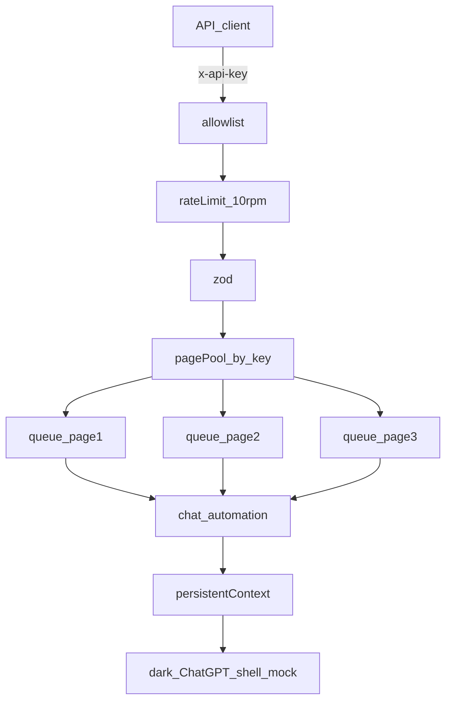

# Chatbot-to-API Bridge — Master Execution Plan

> Nawab master plan — entire project execution contract in one document.  
> **Mode:** project  
> Maintain [`PROGRESS.md`](./PROGRESS.md) during execution.

**This session / current gate:** Attach CDP drive on `feat/v1-bridge` is implemented (`src/automation/cdp-drive.ts`, ADR-015). Launch/mock CI still uses locators. Operator must restart `npm run dev` (tsx does not hot-reload), then confirm **hello** in the composer. Phase H owned URL/session is still optional. See [`docs/CUTOVER.md`](./docs/CUTOVER.md).

---

## §0 Plan metadata

| Field | Value |
|-------|-------|
| **Mode** | project (greenfield, single package) |
| **Stack** | Node 20+ / TypeScript / Express / Playwright / p-queue / zod / pino / express-rate-limit |
| **Base branch** | `main` |
| **Feature branch** | `feat/v1-bridge` |
| **Authority** | `docs/PRD-chatbot-api.md` · `docs/specs/01-improved-spec.md` · `docs/specs/02-chatgpt-dom-contract.md` · `documentation/*` · this file |
| **Lead agent** | Orchestrate, commit, integrate. Subagents do not commit. |

**Security:** never commit ChatGPT tokens/bootstrap/PII; never automate `chatgpt.com`; fail boot if `CHATBOT_URL` host is `chatgpt.com`.

---

## §1 North star & scope

Localhost REST API drives one **persistent Playwright context** with a **per-API-key page pool** (`MAX_PAGES` default **1**, max **3**). One page + one `p-queue` per key. First use of a key always clicks New chat; same key continues on `/chat/send`; `/chat/new` is key-scoped. Rate limit **10 rpm per key**. Mock is the build target until cutover.

### Deliverables

- Dark ChatGPT-shell mock (`create-new-chat-button`, `#prompt-textarea`, send/stop, roles, 3s stream)
- Express: `POST /chat/send`, `POST /chat/new`, `GET /health`
- Playwright lifecycle, storageState, hybrid wait, recover, artifacts
- Page pool + rate limit + tests + CI + `scripts/validate.ps1`
- Cutover notes when owner URL + session arrive

### Non-goals

- Driving chatgpt.com; interactive login in API process; SSE; >3 pages/keys; Docker; stealth plugins

---

## §2 Baseline

| Area | Status |
|------|--------|
| Phase 0 docs on `main` | **DONE** (`5b53e96`) |
| Scaffold, env, mock, browser, page pool, HTTP | **DONE** on `feat/v1-bridge` |
| Core E2E/API tests | **DONE** (expand QA ongoing) |
| Commit matrix for A+ | Execute per §9 |
| Phase H cutover | **BLOCKED** |

Do not rebuild from scratch: harden → fill QA → commit → exit gate.

---

## §3 Architecture

**Request order:** API key → rate limit → validate → enqueue → recover → (first-use or `/chat/new`) → insert → submit → wait → scrape.

**429:** `RATE_LIMITED` vs `QUEUE_FULL` (per page).

---

## §4 Phases A–H

| Phase | Focus | Status |
|-------|--------|--------|
| 0 | Docs foundation | DONE |
| A | Scaffold & zod env | DONE — harden guards |
| B | Mock chatbot (dark shell) | DONE — keep testids/input-arming |
| C | Persistent browser + storageState | DONE — harden relaunch |
| D | Chat insert / hybrid wait / recover | DONE — harden polls/artifacts |
| E | HTTP / queue / rate limit | DONE — harden envelopes |
| F | Tests & QA expansion | IN PROGRESS |
| G | Security review + validate + CI | IN PROGRESS |
| H | Owned URL cutover | BLOCKED |

---

## §5 Playwright playbook (normative)

- Locators only in `src/config/selectors.ts`
- ProseMirror: click → fill → insertText fallback → wait for send
- Hybrid wait: first token then stability (stop gone + text stable); do not require Send after composer clears
- Timeout → stop → scrape → `partial: true` on 504
- Recover replaces that key’s page only; New chat on rebound
- Artifacts under `artifacts/<requestId>/`
- No `networkidle`; no `waitForTimeout` as the done-signal

---

## §6 Mock contract

- `#stage-slideover-sidebar`, `a[data-testid="create-new-chat-button"]`, `main#main`, `#thread`, `#prompt-textarea.ProseMirror`
- Empty: Voice visible; send only after real input
- Default stream 3000ms; `?delayMs=` for tests
- Serve `127.0.0.1:4173`

---

## §7 HTTP

- `HOST=127.0.0.1`, `PORT=8787`
- Success: `partial: false`, `response`, `sessionId`, `durationMs`, `requestId`
- Timeout: 504, `partial: true`
- Env: `API_KEY` / `API_KEYS` (1–3), `MAX_PAGES` (1–3, default 1), `RATE_LIMIT_RPM` (default 10, cap 20)

---

## §8 Tests (must pass)

- 401 / 400 / 429 RATE_LIMITED / QUEUE_FULL / oversize prompt
- E2E send, 3s + 5s complete, timeout partial, new-chat clears, same-key continue, isolation, parallel ≪ 6s
- Dummy page → SELECTOR_NOT_FOUND; process up
- Boot: MAX_PAGES=1 + two keys fails
- Unit: page-pool bind / queue-full
- `scripts/login.ts` mints storageState against mock

QA gate: `npm run typecheck`, `npm test`, `npm run smoke`, `.\scripts\validate.ps1`

---

## §9 Commit matrix

1. docs: PID + DOM + ADR-012/013/014 + shipping maps  
2. chore: package/tsconfig/gitignore  
3. chore: zod env + `.env.example`  
4–7. feat/test: mock + input-gating  
8–14. feat: browser, selectors, page pool, chat, recover  
15–17. feat: Express + queue + rate limit  
18–20. test: API + E2E + QA expansions  
21–23. ci/docs/chore: Actions, README, validate.ps1  
24. docs: cutover — only when URL+session exist  

---

## §10 Exit criteria (P0)

Mock testids; page pool 1–3; first-use New chat; key isolation; hybrid wait; partial flag; 10 rpm; headed+headless; validate green; no secrets; mock default URL; Phase H not started without owner inputs.

---

## §11 Protocol

1. This file is the single contract  
2. Work on `feat/v1-bridge`  
3. Harden + QA + commit per §9  
4. Stop at Phase H until URL + storageState  
5. Do not live-scrape chatgpt.com  
