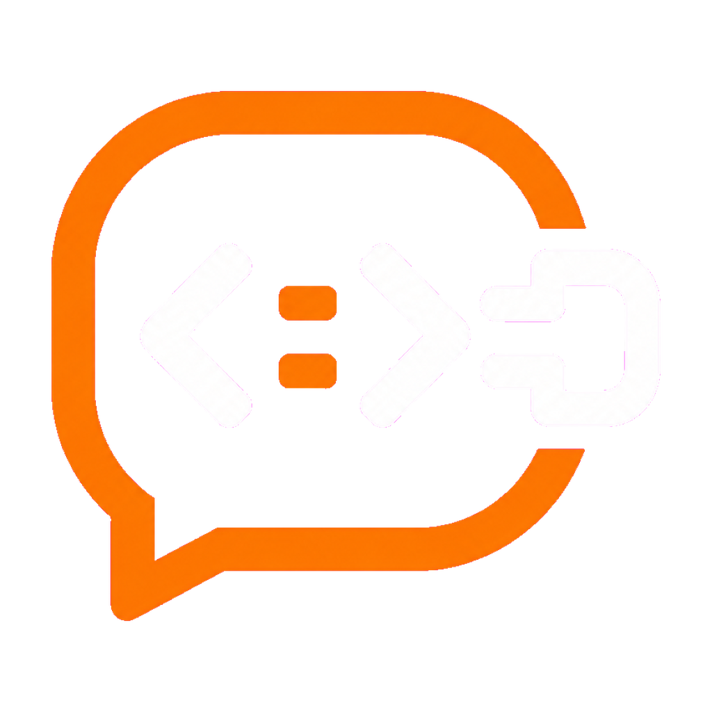
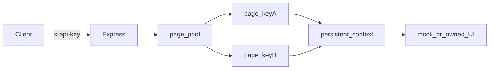

<p align="center">
  
</p>

<p align="center">
  <a href="docs/EXTENSIVE.md"></a>
  <a href="docs/PRD-chatbot-api.md"></a>
  <a href=".github/workflows/ci.yml"></a>
  
</p>

> Full internals (every package, file map, how the repo runs): [Extensive README](docs/EXTENSIVE.md)

**Turn an owned ChatGPT-like web chatbot into a localhost REST API** by driving a real browser with Playwright — not by calling a vendor model API.

> **Chatbot-api is a browser bridge you run on your machine.** It is not a ChatGPT scraper, not a hosted LLM gateway, and not multi-tenant SaaS. Primary interface: `POST /chat/send`. One invariant: **one Playwright page (and queue) per API key**, so conversation context never leaks across keys.

<p align="center">
  <a href="IMPLEMENTATION_PLAN.md"><b>Plan</b></a> ·
  <a href="docs/PRD-chatbot-api.md"><b>PRD</b></a> ·
  <a href="docs/specs/02-chatgpt-dom-contract.md"><b>DOM contract</b></a> ·
  <a href="docs/CUTOVER.md"><b>Cutover</b></a>
</p>

## See it running

```text
$ curl -s http://127.0.0.1:8787/health
{"ok":true,"status":"up","pagesBound":1,"maxPages":1}

$ curl -s -X POST http://127.0.0.1:8787/chat/send \
  -H "content-type: application/json" \
  -H "x-api-key: dev-key-change-me" \
  -d "{\"prompt\":\"hello\"}"
{"ok":true,"partial":false,"response":"Mock reply to: hello",...}
```

The default target is a **dark ChatGPT-shell mock** (`npm run mock`) that implements the same testids your owned clone should expose. Swap `CHATBOT_URL` + a session file when you cut over.

## Why it exists

Many “chatbot APIs” assume you have a model endpoint. Sometimes you only have a **web UI you own**. Chatbot-api makes that UI addressable as JSON: send a prompt, get the last assistant message, with timeouts flagged as `partial: true` instead of silent failure.

## Core techniques

- **Per-key page pool.** Up to three API keys; each key gets its own Playwright page and `p-queue` (`MAX_PAGES` 1–3). First use always clicks **New chat**; later sends on the same key continue the thread. Different keys never share a conversation.
- **Hybrid wait.** After submit, wait for first token (stop button / new assistant node), then poll until text is stable — not `networkidle`, not a blind sleep. Over budget → stop → scrape → HTTP 504 with `partial: true`.
- **ProseMirror-safe insert.** Fill / `insertText` / paste path; the mock only enables Send after a real `input` event so naive `innerHTML` cannot “fake” a send.
- **Loopback-first ops.** Binds `127.0.0.1` by default; rejects `chatgpt.com` as `CHATBOT_URL`; rate-limits ~10 rpm per key.

## The idea

Treat the chatbot like a **remote-controlled tab**, not a model SDK. One persistent Chromium profile holds the login cookies; isolation is **thread-level** (separate pages + New chat), which is enough when every key is you, on one machine, hitting one owned bot.



## Get started

You need **Node 20+**, Chromium for Playwright, and two terminals.

### 1. Install

```powershell
git clone https://github.com/Vinayak-RZ/Chatbot-api.git
cd Chatbot-api
copy .env.example .env
npm install
npx playwright install chromium
```

### 2. Run mock + API

```powershell
npm run mock    # http://127.0.0.1:4173
npm run dev     # http://127.0.0.1:8787
```

### 3. Send a prompt

With the API running, use the try client (reads your local `.env` key; never prints it):

```powershell
npm run try                 # interactive REPL
npm run try -- "hello"      # one-shot
npm run try:ui              # browser UI at http://127.0.0.1:8790
```

Or curl:

```powershell
curl -X POST http://127.0.0.1:8787/chat/send `
  -H "content-type: application/json" `
  -H "x-api-key: YOUR_KEY_FROM_ENV" `
  -d "{\"prompt\":\"hello\"}"
```

Multi-key example (two parallel chats):

```env
MAX_PAGES=2
API_KEYS=key-a,key-b
```

Validate on Windows: `.\scripts\validate.ps1`

## Go deeper

| Doc | What it is |
|-----|------------|
| [Extensive README](docs/EXTENSIVE.md) | Package map, file-by-file why, runtime flow |
| [IMPLEMENTATION_PLAN.md](IMPLEMENTATION_PLAN.md) | Nawab execution contract (Phases A–H) |
| [docs/PRD-chatbot-api.md](docs/PRD-chatbot-api.md) | Product requirements |
| [docs/specs/02-chatgpt-dom-contract.md](docs/specs/02-chatgpt-dom-contract.md) | Selectors the mock and owned UI must share |
| [docs/CUTOVER.md](docs/CUTOVER.md) | Point at your owned URL + `storageState` |
| [documentation/variables.md](documentation/variables.md) | Env inventory |

## Repo layout

```text
src/                  Express + page pool + Playwright automation
scripts/mock-chatbot/ Dark ChatGPT-shell fixture
scripts/validate.ps1  Windows typecheck + smoke + tests
tests/                API, unit, and E2E suites
docs/                 PRD, specs, cutover, extensive internals
```

## Acknowledgements

Built with [Playwright](https://playwright.dev/), [Express](https://expressjs.com/), [zod](https://zod.dev/), [p-queue](https://github.com/sindresorhus/p-queue), and [express-rate-limit](https://github.com/express-rate-limit/express-rate-limit). The mock mirrors public ChatGPT UI landmarks for selector fidelity; it does **not** automate chatgpt.com.

## License

See repository license / owner terms. Session files and `.env` must never be committed.
