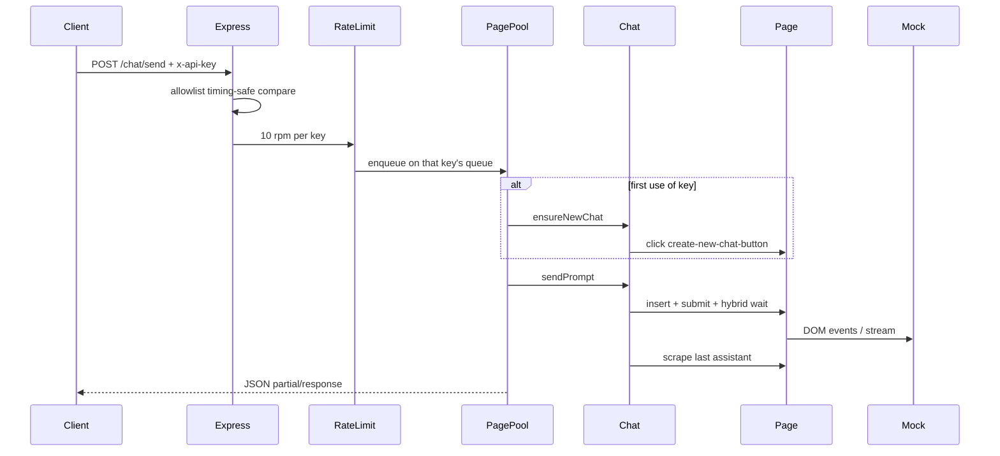

# Chatbot-api — extensive internals

Companion to the main [README](../README.md). How the repo runs, every first-party package, and why the important files exist.

## Table of contents

- [1. How this repository runs](#1-how-this-repository-runs)
- [2. Package map](#2-package-map)
- [3. Packages](#3-packages)
- [4. Configuration](#4-configuration)
- [5. Tests and CI](#5-tests-and-ci)
- [6. Ideas worth understanding](#6-ideas-worth-understanding)
- [7. Further reading](#7-further-reading)
- [8. Future advancements](#8-future-advancements)

## 1. How this repository runs

Two processes in local development:

1. **Mock UI** — `npm run mock` serves a dark ChatGPT-shell on `127.0.0.1:4173`.
2. **API** — `npm run dev` / `npm start` loads env, launches one Chromium persistent context, listens on `127.0.0.1:8787`.

**Boot:** `src/index.ts` → `loadConfig()` → `BrowserManager.start()` → `PagePool` → `createApp()` → `listen(host, port)`. SIGINT/SIGTERM closes pages then the context.

**Cutover:** same code path; `CHATBOT_URL` points at the owned clone and `STORAGE_STATE_PATH` injects cookies. See [CUTOVER.md](./CUTOVER.md).

## 2. Package map

| Package | Path | Role | Entry |
|---------|------|------|-------|
| API runtime | `src/` | Express + page pool + Playwright | `npm run dev` → `src/index.ts` |
| Mock chatbot | `scripts/mock-chatbot/` | ChatGPT-shell fixture for build/E2E | `npm run mock` |
| Tooling scripts | `scripts/` | smoke, login, validate | `npm run smoke` / `login` / `validate.ps1` |
| Tests | `tests/` | env, API, page-pool, mock, E2E | `npm test` |
| Product docs | `docs/` | PRD, specs, cutover, this file | — |
| Shipping maps | `documentation/` | architecture, variables, flows, tests | — |
| Assets | `assets/` | README logo | — |
| CI | `.github/workflows/` | Windows test job | push/PR |

Generated / local-only (not documented file-by-file): `node_modules/`, `dist/`, `data/`, `artifacts/`, `.env`.

## 3. Packages

### 3.1 API runtime (`src/`)

**What it is for.** The production bridge: authenticate, rate-limit, route work to a per-key browser page, return assistant text.

**How it is used.** `tsx src/index.ts` or `node dist/index.js` after `npm run build`. Clients call `/health`, `/chat/send`, `/chat/new`.

**How it works.** Middleware stack on `/chat/*` (request id → API key → rate limit → zod body → `PagePool`). Automation lives under `src/automation/`.

#### File map

| File | Why it is here | What it does |
|------|----------------|--------------|
| `src/index.ts` | Process entry | Load config, start pool, listen, graceful shutdown |
| `src/server.ts` | HTTP composition | Wire Express, health route, `/chat` router, error handler |
| `src/page-pool.ts` | Multi-key isolation | `Map<apiKey,{page,queue}>`, first-use New chat, recover/replace page |
| `src/routes/chat.ts` | API surface | `POST /send` and `/new`, success vs 504 `partial` envelopes |
| `src/middleware/auth.ts` | Authz | Timing-safe allowlist compare on `x-api-key` |
| `src/middleware/errors.ts` | Rate limit + errors | `express-rate-limit`, JSON `AppError` mapping |
| `src/middleware/request-id.ts` | Correlation / artifacts | Sanitize `x-request-id` (no path traversal) |
| `src/config/env.ts` | Boot contract | Zod: keys, `MAX_PAGES`, rpm, loopback `HOST`, reject chatgpt.com |
| `src/config/selectors.ts` | Single locator source | Canonical testids / CSS from DOM contract |
| `src/automation/browser.ts` | Browser lifecycle | Persistent context, storageState cookies, preparePage |
| `src/automation/chat.ts` | Generation | Insert, submit, hybrid wait, scrape, artifacts/trace |
| `src/errors.ts` | Typed failures | `AppError` + codes (`RATE_LIMITED`, `TIMEOUT`, …) |
| `src/logger.ts` | Logging | pino instance |

### 3.2 Mock chatbot (`scripts/mock-chatbot/`)

**What it is for.** A local ChatGPT-like UI so Playwright can be proven without the owned URL.

**How it is used.** `npm run mock`. E2E and smoke hit `http://127.0.0.1:4173`. Optional `?delayMs=` for timing tests. Login at `/auth/login` for `npm run login`.

**How it works.** Static HTML/CSS/JS; `app.js` arms Send only after real input, streams assistant text, swaps Voice/Send/Stop, clears `#thread` on New chat.

#### File map

| File | Why it is here | What it does |
|------|----------------|--------------|
| `scripts/mock-chatbot/server.ts` | HTTP host | Serves public assets; sets `mock_session` cookie on login POST |
| `scripts/mock-chatbot/public/index.html` | DOM contract shell | Sidebar, composer, testids, empty hero |
| `scripts/mock-chatbot/public/styles.css` | Dark UI fidelity | ChatGPT-like layout without OpenAI trademarks |
| `scripts/mock-chatbot/public/app.js` | Behavior | Stream, stop, input-arming, new chat, `__mockChat` test hooks |
| `scripts/mock-chatbot/public/login.html` | Session minting | Fake login form for storageState |

### 3.3 Tooling scripts (`scripts/`)

**What it is for.** Operator and CI helpers outside the long-lived API process.

| File | Why it is here | What it does |
|------|----------------|--------------|
| `scripts/smoke.ts` | Fast readiness | Open `CHATBOT_URL`, assert `#prompt-textarea` (headed if `HEADLESS=false`) |
| `scripts/login.ts` | Session helper | Mock login → write `STORAGE_STATE_PATH` |
| `scripts/validate.ps1` | Windows QA gate | typecheck → ensure mock → smoke → `npm test` |

### 3.4 Tests (`tests/`)

**What it is for.** Prove auth, env guards, page-pool rules, mock gating, and E2E against the mock.

| File | Why it is here | What it does |
|------|----------------|--------------|
| `tests/env.test.ts` | Boot validation | Keys vs pages, chatgpt.com, loopback HOST |
| `tests/api.test.ts` | HTTP contract | 401/400/429, oversize, rate limit (mocked pool) |
| `tests/page-pool.test.ts` | Isolation logic | Bind per key, first-use New chat, QUEUE_FULL (fake browser/chat) |
| `tests/mock-input.test.ts` | Composer contract | innerHTML alone does not enable Send |
| `tests/e2e.test.ts` | Full bridge | send, continue, new-chat clear, isolation, parallel, 5s, timeout, dummy page |

### 3.5 Docs & shipping maps

| Path | Why it is here |
|------|----------------|
| `IMPLEMENTATION_PLAN.md` | Nawab execution contract (Phases A–H) |
| `PROGRESS.md` / `DECISIONS.md` | Live status / ADRs |
| `docs/PRD-chatbot-api.md` | Product truth |
| `docs/specs/*` | Original prompt, improved spec, DOM contract |
| `docs/CUTOVER.md` | Phase H checklist |
| `documentation/*` | Reviewer maps (architecture, variables, flows, tests, …) |
| `assets/chatbot-api-logo.*` | Product README mark |

## 4. Configuration

Authoritative table: [documentation/variables.md](../documentation/variables.md).

Highlights:

| Env | Meaning |
|-----|---------|
| `API_KEY` / `API_KEYS` | Allowlist (1–3). `API_KEYS` wins if both set |
| `MAX_PAGES` | 1–3; must be ≥ number of keys |
| `RATE_LIMIT_RPM` | Default 10, cap 20, per key |
| `CHATBOT_URL` | Mock or owned clone; never chatgpt.com |
| `HOST` | Loopback only (`127.0.0.1` / `localhost` / `::1`) |
| `HEADLESS` | Playwright visibility |
| `USER_DATA_DIR` / `STORAGE_STATE_PATH` | Profile + session JSON (gitignored under `data/`) |
| `GENERATION_TIMEOUT_MS` / `FIRST_TOKEN_TIMEOUT_MS` | Hybrid wait budgets |

Copy `.env.example` → `.env`. Never commit `.env` or session files.

## 5. Tests and CI

- **Local:** `npm run typecheck`, `npm run smoke`, `npm test`, `.\scripts\validate.ps1`
- **CI:** [`.github/workflows/ci.yml`](../.github/workflows/ci.yml) on Windows — `npm ci`, Playwright Chromium, start mock, typecheck, test
- **Map:** [documentation/tests.md](../documentation/tests.md)

## 6. Ideas worth understanding

1. **Thread isolation ≠ account isolation.** One persistent profile shares cookies; keys are separated by pages + New chat. That matches “one human, one owned bot, several concurrent threads.”
2. **Send enablement is a contract.** If automation only sets `innerHTML`, ChatGPT-like composers often send empty. The mock forces the same discipline as the owned UI.
3. **Partial is a first-class outcome.** Timeouts return scraped text with `partial: true` (504) so clients can decide; the queue is not left wedged on purpose — soft recover runs next time.

## 7. Further reading

- [Playwright persistent context](https://playwright.dev/docs/auth#reuse-authentication-state)
- [express-rate-limit](https://express-rate-limit.github.io/express-rate-limit/)
- In-repo: [DOM contract](./specs/02-chatgpt-dom-contract.md), [architecture](../documentation/architecture.md), [flows](../documentation/flows.md)

## 8. Future advancements

1. **Why now:** Owned URL + session still block Phase H. **What would land:** verified selector report + cutover smoke checklist filled in `docs/CUTOVER.md`. **Done when:** three routes green against the owned clone.
2. **Why now:** Tracing is context-wide and can mix keys on concurrent failures. **What would land:** per-page tracing or disable tracing when `MAX_PAGES > 1`. **Done when:** artifact zip cannot contain another key’s DOM.
3. **Why now:** `LOG_PROMPTS` is parsed but unused. **What would land:** wire redaction toggle in chat/route logging. **Done when:** enabling the flag visibly changes logs in a test.
4. **Why now:** P1 asks for client `sessionId` / SSE. **What would land:** optional SSE progress events without changing the default JSON contract. **Done when:** documented behind a flag and covered by one E2E.
